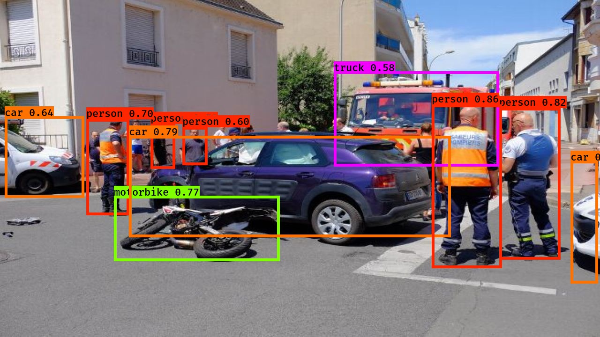

# Autonomous-driving-Car-detection
Implement YOLO and dep CNN model to detect objects from images in relation with Autonomous Driving car detection system.

## Description
This project is part of Deep Learning Specialization from Deeplearning.ai available on Coursera.

The objective of the project is to implement YOLO ("You Only Look Once") algorithms to identify objects on images relevant for Autonomous Driving. 80 different object classes are detected.

YOLO model has been described in the following papers:
- [Redmon et al., 2016](https://arxiv.org/abs/1506.02640)
- [Redmon and Farhadi, 2016](https://arxiv.org/abs/1612.08242)

YOLO "only looks once" at the image in the sense that it requires only one forward propagation pass through the network to make predictions. After non-max suppression, it then outputs recognized objects together with the bounding boxes. The non-max suppression algorithm reduces the number of identified bounding boxes only to the most meaningful ones.

The YOLO model implementation uses a pre-trained deep CNN which converts a preprocessed batch of input images (shape: (m, 608, 608, 3)) into a tensor of shape (m, 19, 19, 5, 85) which basically contains a list of bounding boxes with recognized classes.

## Content
- Problem statement
- YOLO model description and implementation
  - Filtering with a threshold on class scores
  - Non-max suppression
  - wrapping up the filter
- Testing YOLO pre-trained model on images

## Dependencies
The notebook uses keras and tensorflow v1.
Sample images are preprocessed to the requierements of the pre-trained model.
Helper functions are provided in the file `yolo_utils.py`.
Pretrained weights, claases, bounding box settings, all relevant parts of the model, are provided in the model_data folder.

# Implementation
- Download the repository
- insert your own images for detection in the `images` folder
- run the notebook
- Resulting images are saved in the `out` folder

## Results

